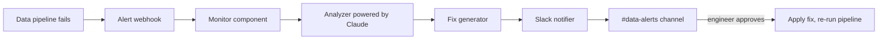
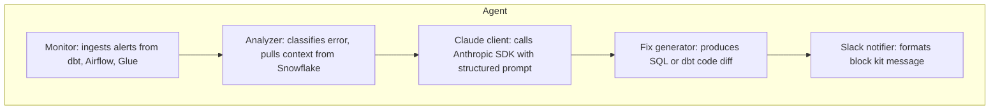
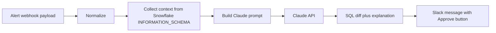

# AI SQL Agent Architecture

An AI agent that monitors data pipelines, diagnoses failures with Claude, generates SQL fixes, and posts plain-English explanations to Slack. The goal is to compress mean time to recovery from hours to minutes by letting engineers act on a proposed fix instead of starting from a raw stack trace.

## Core Value

- Listens to pipeline alerts
- Classifies the error into a known pattern
- Asks Claude for a root cause and a SQL or dbt fix
- Posts a concise Slack message with the diff and a one-click approve

## Failure Flow



## Components



## Supported Error Patterns

| Pattern | Signal | Typical Fix |
|---|---|---|
| Slow queries | Runtime above threshold, full table scan | Add clustering key, rewrite join, push filter earlier |
| Schema drift | Column added or type changed upstream | Update dbt source, add cast, alert downstream owners |
| Null explosion | Null rate above baseline by 3 standard deviations | Add `not_null` test, add coalesce, flag upstream data |
| Failed dbt tests | `unique`, `not_null`, `relationships`, or custom test failure | Generate data fix SQL, open an issue with offending rows |

## Data Flow



## Tech Stack

| Layer | Choice |
|---|---|
| Runtime | Python 3.11 |
| LLM | Anthropic Claude via `anthropic` SDK |
| Warehouse | `snowflake-connector-python` |
| Messaging | `slack_sdk` |
| Web | FastAPI endpoint to receive alert webhooks |
| Testing | `pytest` with mocks for external clients |

## Repository Layout

```
ai-sql-agent-for-data-analytics-automation/
  src/
    monitor.py
    analyzer.py
    fix_generator.py
    slack_notifier.py
    prompts/
  tests/
  docs/
  requirements.txt
  README.md
```

## Security and Safety

- The agent never executes generated SQL automatically. All fixes require explicit engineer approval in Slack.
- Snowflake user is read-only by default for diagnosis, write access is granted only for the fix-apply path and scoped to a dedicated role.
- Secrets live in environment variables or a secret manager, never in source.
- Prompts are versioned so behavior changes are reviewable.

## Extension Points

- Add a new error pattern by implementing a `Detector` that returns `(pattern_name, context_dict)`.
- Add a new warehouse by implementing a `ContextCollector` with a `describe(table)` method.
- Swap the notifier to PagerDuty or email by implementing the `Notifier` interface.
